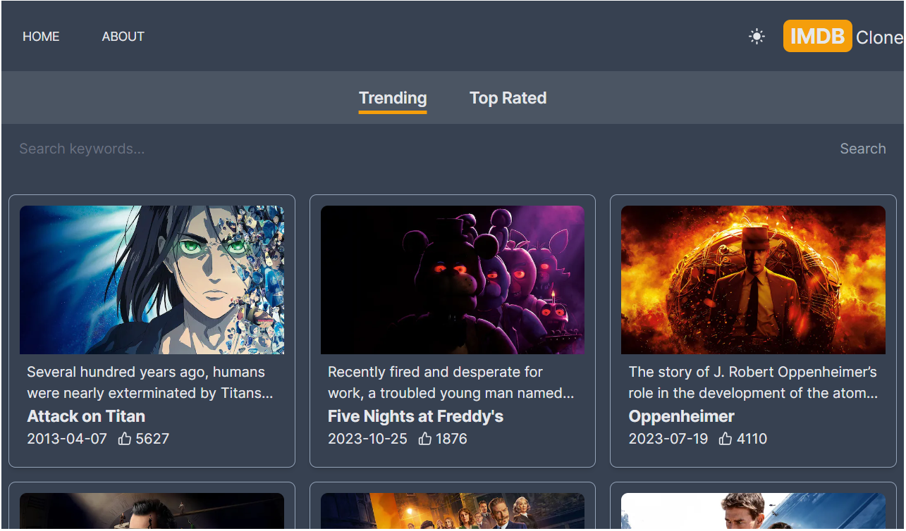

  <h1>IMDB Clone</h1>

  

## ✔️ Técnicas e tecnologias utilizadas

Lista de tecnologias que foram usadas nesse projeto:

### Outras bibliotecas

- [tailwindcss-line-clamp](https://github.com/tailwindlabs/tailwindcss-line-clamp)

## 🛠️ Abrir e rodar o projeto

Para abrir e rodar o projeto, entre na pasta do frontend execute `npm install` para instalar as dependências e `npm run dev` para iniciar o projeto.

Depois, acesse <a href="http://localhost:3000/">http://localhost:3000/</a> no seu navegador.

### Projeto em produção

Este projeto pode ser visualizado neste [link](https://imdb-mdmh0gajk-grazziano.vercel.app/).

## 📚 Mais informações

Entre em contato pelo [linkedin](https://www.linkedin.com/in/grazziano-fagundes/).

  <small>Grazziano Borges Fagundes - 2023</small>

